# 2021-2022_Dabadie_Labrousse

Projet **capteur de déformation low-tech à base de graphite** dans le cadre de l'UF "du capteur au banc de test" en 4ème année Génie Physique à l'INSA Toulouse. Le capteur est basé sur la variation de résistance engendrée par la déformation du capteur. En effet, le capteur repose sur le principe physique de déplacement par effet tunnel des électrons entre les nanoparticules de graphite. Lorsqu'une contrainte mécanique est appliquée sur le capteur, la distance entre les nanoparticules varie, entraînant une modification de la conductivité du capteur, et donc une variation de sa résistance qui est mesurable.

Ce fichier décrit toutes les étapes nécessaires à la réalisation du capteur: 
1. le schéma électrique sur le logiciel *LTSpice* afin de simuler la réponse idéale du capteur
2. la réalisation du shield avec le logiciel *KiCad* 
3. le code Arduino
4. l'application APK pour téléphone permettant l'envoi et la réception de données avec le capteur via un module Bluetooth
5. le protocole du banc de test

# 1. Introduction: Description du projet et Cahier des Charges

Le projet est réalisé par binôme et comprend plusieurs livrables:
- un shield PCB 
- un code Arduino permettant l'acquisition de la mesure de résistance ainsi que le contrôle des fonctionnalités du shield (affichage sur l'écran OLED, commmunication Bluetooth, encodeur rotatif, potentiomètre digital)
- une application Android APK
- une datasheet du capteur

Pour mener à bien ce projet, nous avons simulé le capteur sur *LTSpice*, puis rédigé le code Arduino fonctionnel permettant la mesure de la résistance du capteur et le contrôle des autres éléments du shield (écran OLED, module Bluetooth, encodeur rotatif, potentiomètre digital). Nous avons par la suite branché tous les éléments sur une breadboard reliée à une carte Arduino Uno afin de tester la fonctionnalité du code. En parallèle nous avons designé le PCB avec le logiciel *KiCad* et l'application téléphone APK grâce au logiciel *MIT APP Inventor*. Après avoir designé le PCB, nous l'avons fabriqué et avons assemblé les composants dessus en les soudant. Enfin, nous avons caractérisé et testé le capteur en déposant du graphite issu de crayon à papier dessus. La dernière étape fut de mesurer la variation de résistance relative du capteur en fonction de sa déformation. 

Liste du matériel nécessaire au projet:
- 1 carte Arduino Uno
- 3 condensateurs de 100nf
- 1 condensateur de 1µF
- 2 résistances de 100kΩ
- 1 résistance de 10kΩ
- 1 résistance de 1kΩ
- 1 AOP LTC1050
- 1 module Bluetooth HC-05
- 1 écran OLED I2C
- 1 encodeur rotatif KY-040
- 1 potentiomètre digital MCP-41XXX

# 2. Simulation du circuit transimpédance avec le logiciel *LTSpice*

Le capteur délivre un courant de faible intensité et la carte Arduino Uno mesure seulement des tensions entre 0 et 5V. Il est donc nécessaire d'intégrer un circuit transimpédance afin de convertir les variations de courant du capteur en variations de tension mesurable par la carte. Ce circuit doit aussi réduire les bruits liés à la mesure et amplifier le signal d'entrée pour pouvoir délivrer une tension mesurable.
Le document nommé Simulation_Capteur présente l'essentiel des informations liées à la simlation du capteur.

# 3. Code Arduino 
# 3.1 Librairies nécessaires
Le code rédigé sous Arduino utilisent plusieurs librairies permettant la gestion des différents élements du shield. Les librairies nécessaires sont:
- [Adafruit_BusIO](https://github.com/MOSH-Insa-Toulouse/2021-2022_Dabadie_Labrousse/tree/main/Code_Arduino/Librairies/Adafruit_BusIO)
- [Adafruit_GFX_Library](https://github.com/MOSH-Insa-Toulouse/2021-2022_Dabadie_Labrousse/tree/main/Code_Arduino/Librairies/Adafruit_GFX_Library)
- [Adafruit_SSD1306](https://github.com/MOSH-Insa-Toulouse/2021-2022_Dabadie_Labrousse/tree/main/Code_Arduino/Librairies/Adafruit_SSD1306)

# 3.2 Code
Le [code Arduino](https://github.com/MOSH-Insa-Toulouse/2021-2022_Dabadie_Labrousse/tree/main/Code_Arduino/Code) connecte tous les élements du shield ensemble et assure son bon fonctionnement. Les fonctionnalités principales du shield permises par le code Arduino sont:
- acquisition et affichage de la résistance du capteur sur l'écran OLED en temps réel lors de sa déformation
- acquisition et affichage de la tension mesurée par la carte Arduino UNO sur l'écran OLED en temps réel lors de la déformation du capteur
- affichage d'un menu sur l'écran OLED contrôlé par l'encodeur rotatif
- envoi et réception de données sur télephone Android via le module Bluetooth
- Calibrage automatique du potentiomètre digital pour permettre une mesure de résistance aux conditions idéales de la carte Arduino Uno (tension mesurée lorsque le capteur est à plat vaut environ 2.8V (Range Arduino [0 - 5]V)).

# 4. Création du PCB sur le logiciel *KiCad*
## 4.1 Elaboration des symboles et empreintes

Dans cette section, les symboles et empreintes des composants non initialement présents sur le logiciel *KiCad* sont présentés. 

- Amplificateur Opérationnel LTC1050

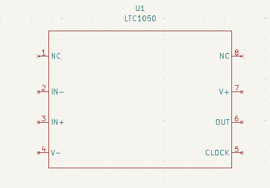    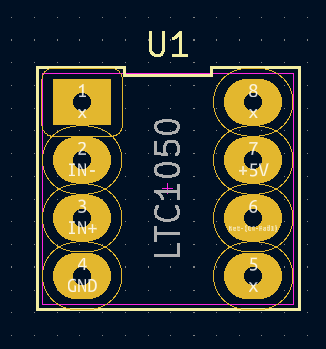

- Module Bluetooth HC-05

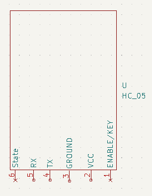    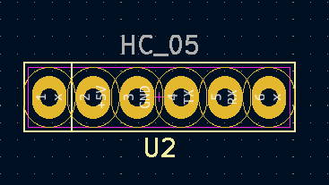

- Ecran OLED I2C

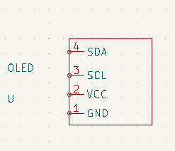    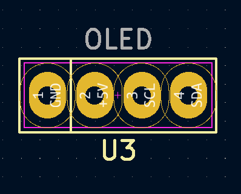

- Encodeur rotatif KY-040

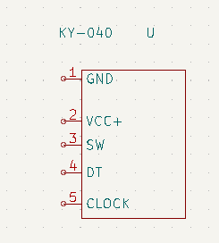    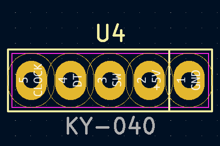

- Potentiomètre digital MCP-41XXX

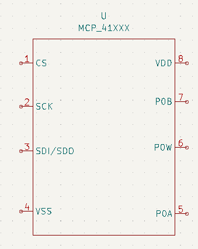    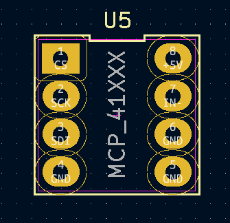

## 4.2 Schéma complet

Après avoir élaboré les schémas et empreintes de chaque élements, nous avons réalisé le schéma électrique complet du shield de l'Arduino en reliant les pins des élements avec ceux de la carte Arduino.

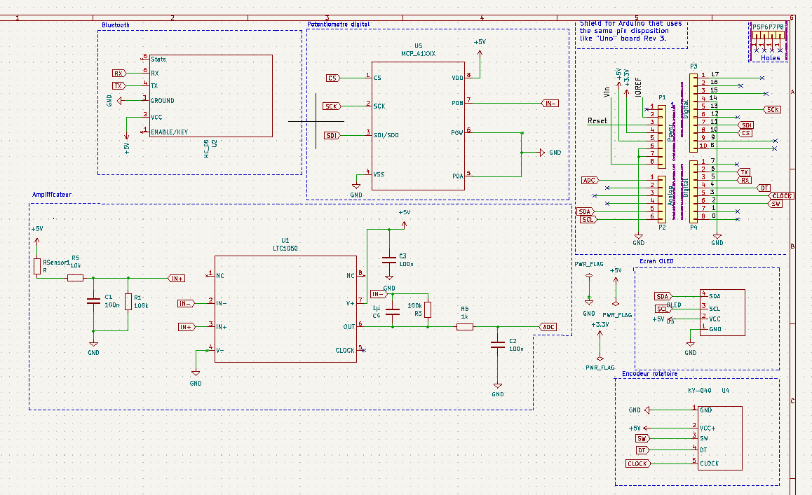

## 4.3 PCB 

Suite à la réalisation du schéma, nous devons intégrer les composants sur le PCB. Nous avons conçu le PCB ci-dessous avec le logiciel KiCad.

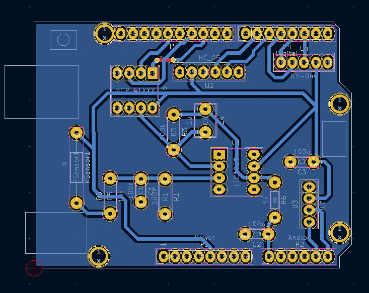

## 4.4 Vue 3d du Shield

L'organisation en 3d du shield réalisé est visible ci-dessous:
- Vision du dessus

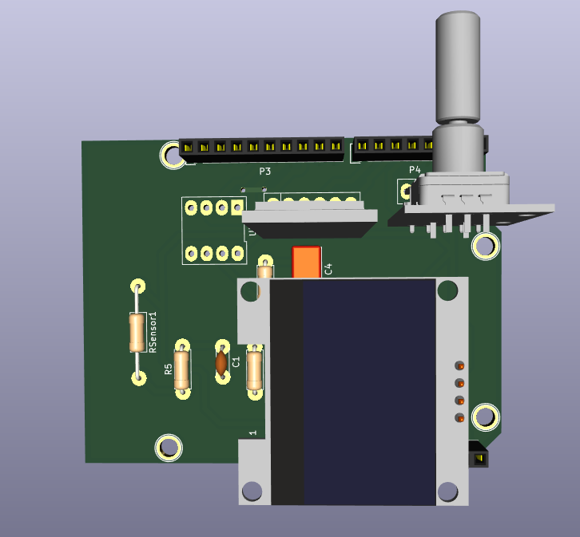

- Vision de dessous

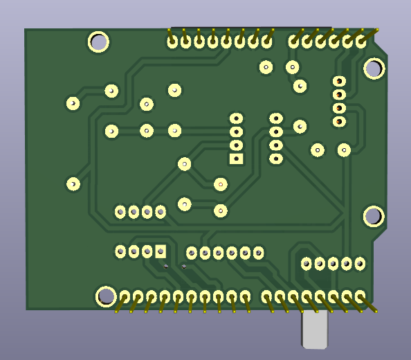

# 5. Fabrication du shield

Le circut imprimé a été réalisé à partir d'un calque du PCB.

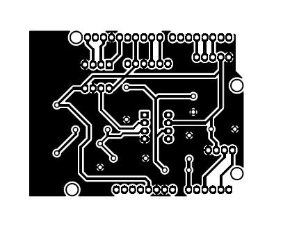

Nous avons imprimé les motifs sur une plaquette époxy recouverte de cuivre, puis gravé les pistes conductrices. Après avoir réalisé le circuit imprimé, nous avons percé les trous et soudé les composants sur le shield afin qu'il soit fonctionnel.

# 6. Application télephone APK

L'application à été développé avec le logiciel *MIT App Inventor*. Elle permet d'envoyer et recevoir des données entre la carte Arduino Uno et un téléphone via le module Bluetooth HC-05.
L'application est dotée de 3 fonctionnalités:
- Affichage de la Résistance du capteur en temps réel
- Affichage de la tension de sortie du circuit transimpédance en temps réel
- Affichage de la variation de résistance du capteur sous forme de graphique en temps réel

# 7. Banc de test
# 7.1 Description du banc de test

Pour effectuer nos tests, nous avons imaginé un banc de test low-tech très facile d'usage. Malgré l'existence de bancs de test fabriqués par nos prédecesseurs, nous les trouvions peu pratiques. En effet, le premier banc composé de 7 demi-cercles de rayons différents fabriqués en imprimante 3D n'avait pas les bonnes dimensions pour placer le capteur et les pinces crocodiles.

- Banc de test prédecesseurs
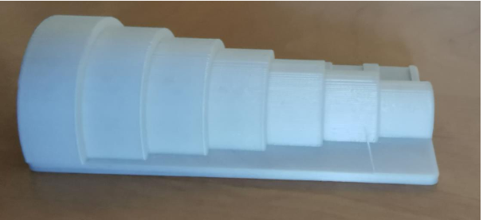

Nous avons donc décidé dans le temps imparti de créer un banc de test seulement composé de cercles sur un papier, qui peut être réalisé n'importe où. 

- Banc de test fabriqué
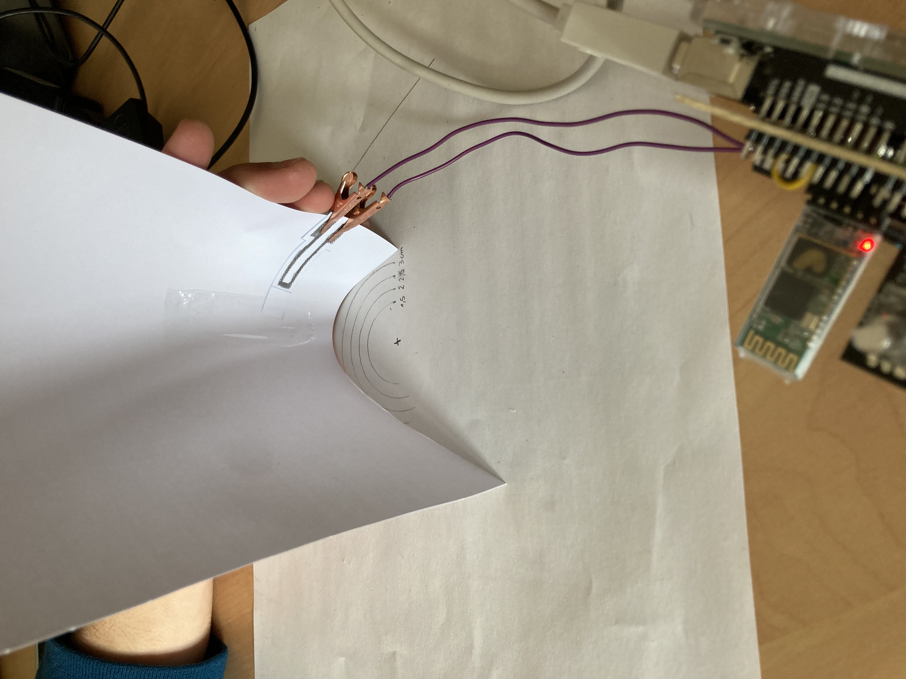

L’objectif de ce banc de test est de déterminer la variation relative de résistance de notre capteur en fonction de la déformation appliquée. Des cercles d’un rayon variant de 3cm à 1cm, avec un pas de 0,5cm sont tracés sur une feuille de papier. Le capteur graphite est quant à lui scotché par une extrémité sur une autre feuille rigide, et pincé au niveau des pins de l’autre extrémité. L’objectif est de courber la feuille de papier rigide sur laquelle est scotché le capteur, afin que celui-ci adopte la forme des cercles de différents rayons. 

Le protocole de test est décrit dans la [Datasheet](https://github.com/MOSH-Insa-Toulouse/2021-2022_Dabadie_Labrousse/blob/main/Banc_de_Test_Datasheet/Datasheet.pdf). Nous avons réalisé ce protocole pour 3 différents types de crayons: H, HB, B.

# 7.2 Résultats et analyse

Pour les 3 types de crayons, nous obtenons des courbes quasi-linéaires, ce qui démontre le bon fonctionnement du capteur. L'ensemble des résultats sont disponibles dans le fichier [Banc de test](https://github.com/MOSH-Insa-Toulouse/2021-2022_Dabadie_Labrousse/blob/main/Banc_de_Test_Datasheet/Banc%20de%20test.xlsx).

# 7.3 Discussion 

Le banc de test imaginé est un banc de test destructif, c'est-à-dire que le capteur est fortement endommagé lors du protocole de test, notamment en tension. Ainsi, la non-répétabilité de la mesure pause un réel problème concernant sa précision. Les courbes obtenues lors des tests ne sont pas totalement linéaires, d'où une certaine imprécision. Enfin, le dépôt de graphite sur le capteur est totalement aléatoire, il est donc difficile de comparer directement la résistance des différents crayons.

La création d'un banc de test low-tech non destructif par exemple à l'aide d'un servomoteur contrôlé par l'Arduino pourrait être une solution. De plus, un processus automatique de dépôt uniforme de graphite pourrait être mis en oeuvre.

Néanmoins, la création de jauges de contrainte low-tech à base de graphite est réalisable, comme démontré dans ce projet.

# 8. Auteurs

Si vous avez des questions ou de remarques complémentaires concernant ce projet capteur, veuillez nous contacter:
- Mattéo Labrousse: labrouss@insa-toulouse.fr
- Raoul Dabadie: rdabadie@insa-toulouse.fr
